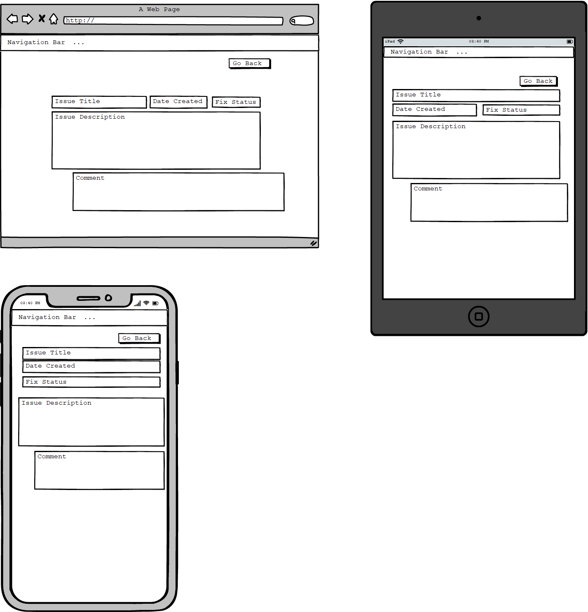
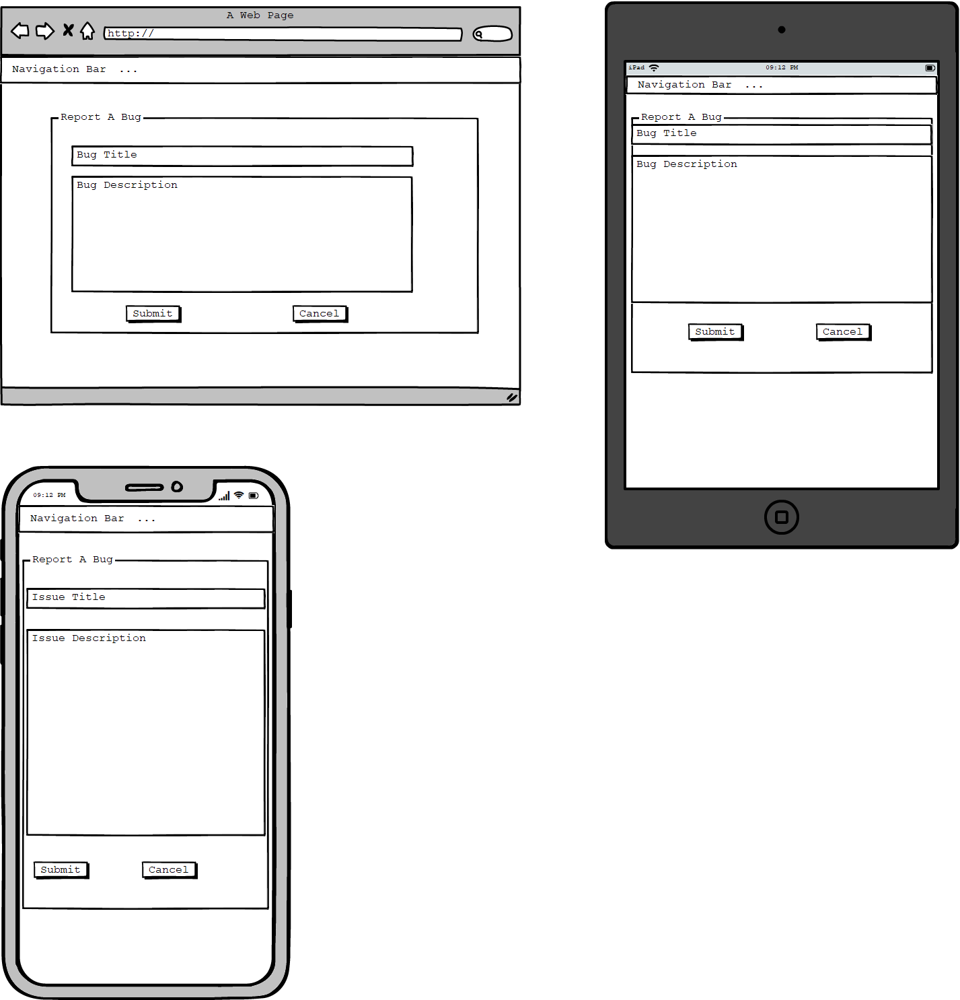
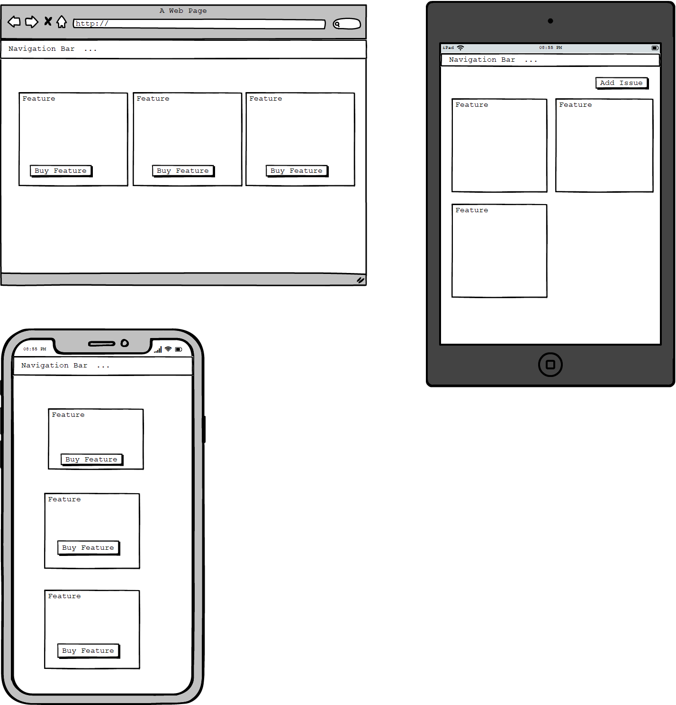
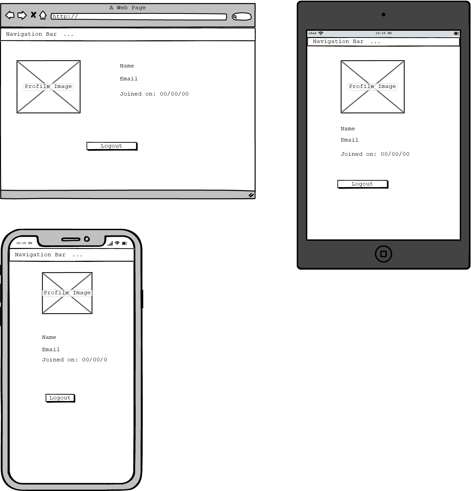

# Issue Tracker
An Django app for reporting bugs and purchasing features. 

## UX

#### Wireframes
* All Bugs 
* Single Bug 
* Report A Bug 
* Features 
* User Profile 
   
## Features

#### Existing Features

## Technologies Used

## Deployment
This project was created using the Visual Studio Code text editor. Version control was carried out entirely using git.  
Before deploying to Heroku I created a requirements.txt file to list all the dependencies used in this project. 
The following were set as config variables in Heroku, and as environment variables for local coding:
DATABASE_URL
SECRET_KEY

Procfile
Add Heroku to ALLOWED_HOSTS

## Testing
Checked views.py file using PEP8 online code checker

## Credits

#### Content

#### Media

#### Acknowledgements
Thanks to my coursemate John Longgately for providing this line of code 'dist: xenial' to solve the issue with Travis integration.

navbar right https://stackoverflow.com/questions/53339351/how-to-create-navigation-bar-with-login-sign-up-button-in-bootstrap-4
First answer by Razvan Zamfir

paginator code from documentation